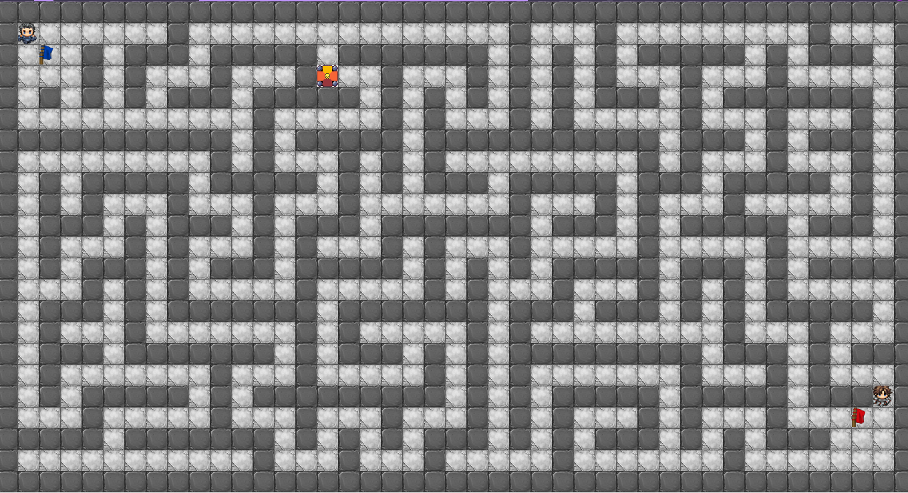

# MazeCTF

Game, written in JAVA to Capture the Flag inside a Maze.

## Motivation

I have made this game as a college project. The idea was to make a game in JAVA.
My idea was to create a **Capture the Flag** type of game in which we would have two players playing simultaneously in a Maze.

The player which brings the oponent's flag to its own base, wins the game.

## Considerations

This game was developed with educational purpose. 

Use it at your ouw risk.

## Dependencies

* [rxtx](https://github.com/rxtx/rxtx);
* [java jdk 11](https://www.oracle.com/java/technologies/javase-jdk11-downloads.html);

## Developer

|  |
|:---------------------------------------------------------------------------------:|
| [Edimar Calebe Castanho (Calebe94)](https://github.com/Calebe94)                  |

# License

All software is covered under [MIT License](https://opensource.org/licenses/MIT).

Permission is hereby granted, free of charge, to any person obtaining a copy of this software and associated documentation files (the "Software"), to deal in the Software without restriction, including without limitation the rights to use, copy, modify, merge, publish, distribute, sublicense, and/or sell copies of the Software, and to permit persons to whom the Software is furnished to do so, subject to the following conditions:

The above copyright notice and this permission notice shall be included in all copies or substantial portions of the Software.

THE SOFTWARE IS PROVIDED "AS IS", WITHOUT WARRANTY OF ANY KIND, EXPRESS OR IMPLIED, INCLUDING BUT NOT LIMITED TO THE WARRANTIES OF MERCHANTABILITY, FITNESS FOR A PARTICULAR PURPOSE AND NONINFRINGEMENT. IN NO EVENT SHALL THE AUTHORS OR COPYRIGHT HOLDERS BE LIABLE FOR ANY CLAIM, DAMAGES OR OTHER LIABILITY, WHETHER IN AN ACTION OF CONTRACT, TORT OR OTHERWISE, ARISING FROM, OUT OF OR IN CONNECTION WITH THE SOFTWARE OR THE USE OR OTHER DEALINGS IN THE SOFTWARE.
